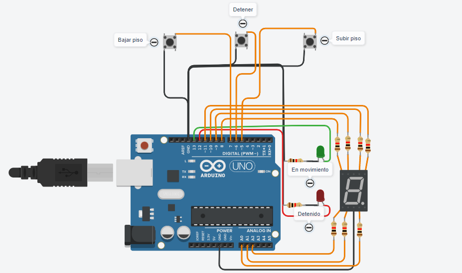

### Ezequiel Fleitas
#  PRUEBA SPD - MONTACARGAS

## Proyecto: MONTACARGA



### Descripción
Nos pide armar un modelo de montacarga funcional como maqueta para un hospital. El
objetivo es que implementes un sistema que pueda recibir ordenes de subir, bajar o pausar
desde diferentes pisos y muestre el estado actual del montacargas en el display 7 segmentos.

---

### Función Principal
1.Primero, se definen las asignaciones de pines para los botones (p_subir, p_detener, p_bajar), los LED (led_rojo, led_verde) y los pines para controlar el display de 7 segmentos 


2.En la función setup(), se configuran los modos de los pines (entrada o salida) y se inicia la comunicación serial.

3.El bucle principal loop() se ejecuta continuamente y realiza las siguientes acciones:

* El código verifica si los botones de subir piso (p_subir), bajar piso (p_bajar) y detener (p_detener) han sido presionados y todos los casos, se añade un retardo de 200 milisegundos para evitar rebotes en los botones.

    * Si el botón de subir piso es presionado y el montacargas no está en pausa, se verifica si el piso actual es menor a 9. En ese caso, se activa el movimiento del montacargas, se muestra el piso actual en el display de 7 segmentos y se envía un mensaje indicando que el montacargas está subiendo. Si el piso actual es 9, se envía un mensaje indicando que el montacargas ya se encuentra en el último piso.

    * Si el botón de bajar piso es presionado y el montacargas no está en pausa, se verifica si el piso actual es mayor a 0. En ese caso, se activa el movimiento del montacargas hacia abajo, se muestra el piso actual y se envía un mensaje indicando que el montacargas está bajando. Si el piso actual es 0, se envía un mensaje indicando que el montacargas ya se encuentra en el primer piso.

    * Si el botón de detener es presionado y el montacargas está en movimiento, se detiene el montacargas, se establece en pausa, se muestra el piso actual en el puerto serial y se envía un mensaje indicando que el montacargas se detuvo en ese piso.


* Si el montacargas está en movimiento (enMovimiento es true), se produce un retardo de 3 segundos y luego se ejecuta el siguiente bloque:

    * Si el piso actual es menor a 9, se llama a movimientoMontaCargas() para encender el LED verde y apagar el LED rojo, se incrementa el piso actual, se muestra el piso actual en el display de 7 segmentos y se envía un mensaje indicando que el montacargas está subiendo.

    * Si el piso actual es mayor a 0, se llama a movimientoMontaCargas() para encender el LED verde y apagar el LED rojo, se decrementa el piso actual, se muestra el piso actual en el display de 7 segmentos y se envía un mensaje indicando que el montacargas está bajando.

4.La función mostrarPiso(int piso) se utiliza para encender y apagar los segmentos del display de 7 segmentos de acuerdo al piso especificado.

5.La función prendeYApaga(int a, int b, int c, int d, int e, int f, int g) se utiliza para encender o apagar los segmentos individuales del display de 7 segmentos según los valores proporcionados.

6.La función detenerMontacargas() se utiliza para detener el montacargas apagando el LED verde y encendiendo el LED rojo.

7.La función movimientoMontaCargas() se utiliza para indicar el movimiento del montacargas encendiendo el LED verde y apagando el LED rojo.

---

### Codigo del Proyecto


```c++
void loop() {
    if (digitalRead(p_subir) == LOW) {
    
        if (enPausa) {
            enPausa = false;
        }
        else {
            if (pisoActual < 9) {
                enMovimiento = true;
                mostrarPiso(pisoActual);
                Serial.println("Montacargas subiendo");
            }
            else {
                Serial.println("El montacargas ya se encuentra en el último piso");
            }
        }
        delay(200); 
    }
    if (digitalRead(p_bajar) == LOW) {
        if (enPausa) {
            enPausa = false;
        }
        else{
            if (pisoActual > 0) {
            enMovimiento = true;
            mostrarPiso(pisoActual);
            Serial.println("Montacargas bajando");
            }    
            else {
                Serial.println("El montacargas ya se encuentra en el primer piso");
		    }
        }
        delay(200); 
    }
    if (digitalRead(p_detener) == LOW) {
        if (enMovimiento) {
        detenerMontacargas();
        enMovimiento = false;
        enPausa = true;
        Serial.print("Montacargas detenido en el piso: ");
          Serial.println(pisoActual);
        }
        delay(200); 
    }
  
    if (enMovimiento) { 
        delay(3000);         
        if (pisoActual < 9) {
            movimientoMontaCargas();
            pisoActual++;
            mostrarPiso(pisoActual);
            Serial.print("Montacargas subiendo, piso: ");
        } 
        else{
            if(pisoActual > 0){
                movimientoMontaCargas();
                pisoActual--;
                mostrarPiso(pisoActual);
                Serial.print("Montacargas bajando, piso: ");
            }
        }
        
        Serial.println(pisoActual);
    
        if (pisoActual == 9 && !enPausa) {
            detenerMontacargas();
            enMovimiento = false;
            Serial.println("Montacargas detenido en el piso 9");
        }
    }
}

void mostrarPiso(int piso){
    switch(piso){
        case 0:
            prendeYApaga(1,1,1,1,1,1,0);
        break;
        case 1:
            prendeYApaga(0,1,1,0,0,0,0);
        break;
        case 2:
            prendeYApaga(1,1,0,1,1,0,1);
        break;
        case 3:
            prendeYApaga(1,1,1,1,0,0,1);
        break;
        case 4:
            prendeYApaga(0,1,1,0,0,1,1);
        break;
        case 5:
            prendeYApaga(1,0,1,1,0,1,1);
        break;
        case 6:
            prendeYApaga(1,0,1,1,1,1,1);
        break;
        case 7:
            prendeYApaga(1,1,1,0,0,0,0);
        break;
        case 8:
            prendeYApaga(1,1,1,1,1,1,1);
        break;
        case 9:
            prendeYApaga(1,1,1,0,0,1,1);
        break;
    }
}

void prendeYApaga(int a, int b, int c, int d, int e, int f, int g)
{
    digitalWrite(A, a);
    digitalWrite(B, b);
    digitalWrite(C, c);
    digitalWrite(D, d);
    digitalWrite(E, e);
    digitalWrite(F, f);
    digitalWrite(G, g);
}

void detenerMontacargas() {
    digitalWrite(led_rojo, HIGH); 
    digitalWrite(led_verde, LOW); 
}
void movimientoMontaCargas() {
    digitalWrite(led_rojo, LOW); 
    digitalWrite(led_verde, HIGH); 
}
```

### Link del proyecto
[tinkercard.com](https://www.tinkercad.com/things/gha81N38157 "Link al arduino")